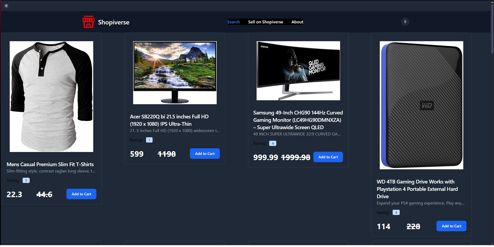
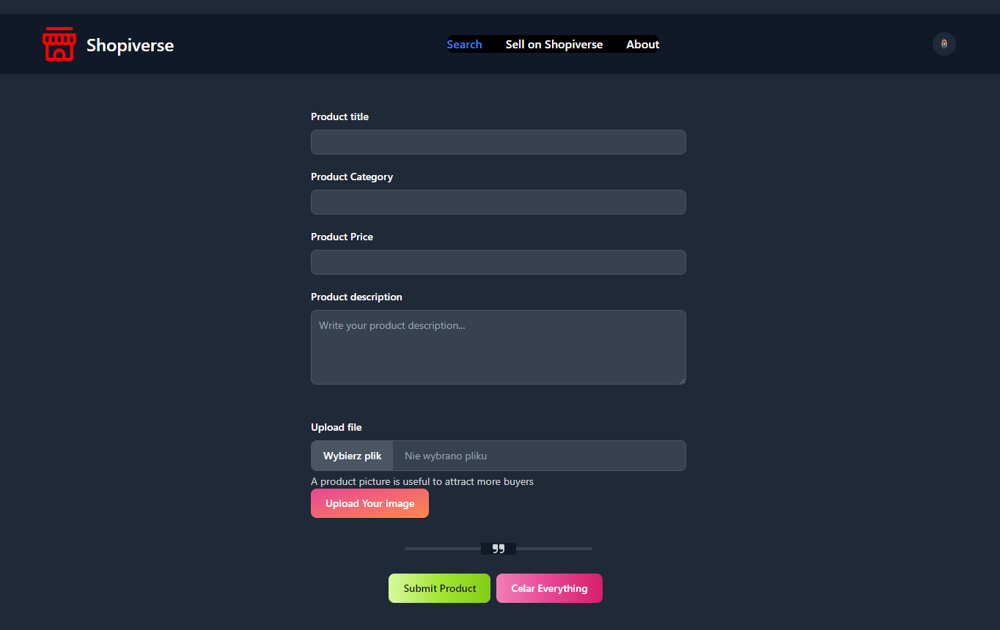
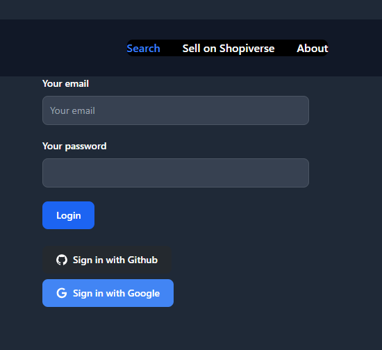
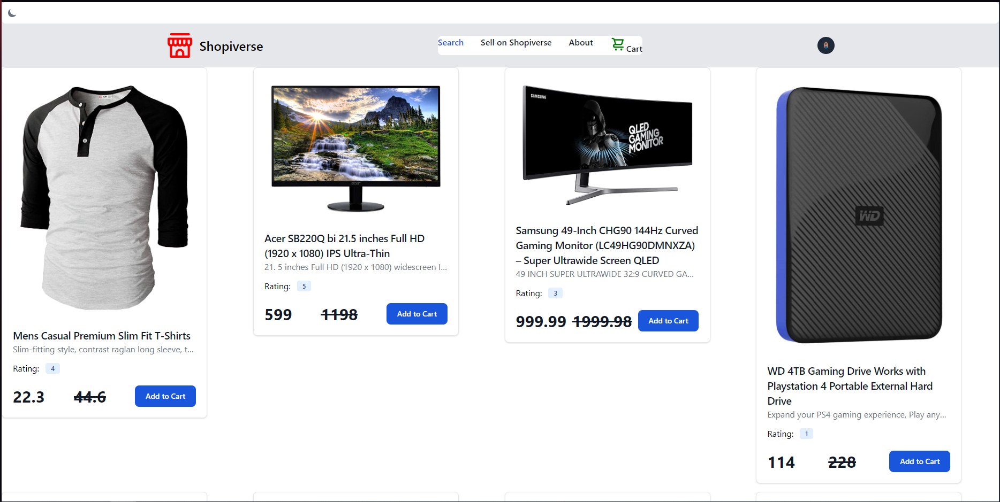

# 🏬 Shopiverse – Nowoczesna imitacja sklepu internetowego

Shopiverse to aplikacja internetowa, która imituje prawdziwy sklep online. Produkty są pobierane z **Fake Store API** i prezentowane w przejrzysty oraz estetyczny sposób. Aplikacja oferuje możliwość wyszukiwania produktów w czasie rzeczywistym, sprzedaży własnych przedmiotów oraz integrację z systemem logowania opartym na **GitHub, Google i lokalnych kontach**.

## ✨ Funkcje aplikacji

- **Dynamiczne pobieranie produktów** – dane pobierane są z Fake Store API.
- **Tryb jasny i ciemny** – użytkownik może przełączać motyw strony, klikając ikonę słońca/księżyca w lewym górnym rogu.
- **Wyszukiwanie w czasie rzeczywistym** – produkty można wyszukiwać bez przeładowywania strony.
- **Możliwość dodawania własnych produktów** – Shopiverse jest połączone z **Supabase**, dzięki czemu dodane produkty pozostają w bazie.
- **Rejestracja i logowanie** – obsługa logowania przez konto Google, GitHub oraz klasyczną rejestrację.
- **Strona koszyka** – po zalogowaniu użytkownik zyskuje dostęp do koszyka, w którym znajdują się produkty gotowe do kupna.
- **Sekcja „O nas”** – zawiera informacje o aplikacji.

## 🖥️ Zrzuty ekranu

### 📌 Strona główna


### 🛒 Strona sprzedaży


### 🔑 Strona logowania


### 👤 Widok użytkownika po zalogowaniu


## 🚀 Jak uruchomić projekt lokalnie?

1. **Sklonuj repozytorium**:
   ```sh
   git clone https://github.com/Mike331122/Shopiverse.git
   ```

2. **Przejdź do katalogu projektu**:
   ```sh
   cd Shopiverse
   ```

3. **Zainstaluj zależności**:
   ```sh
   npm install
   ```

4. **Uruchom aplikację w trybie deweloperskim**:
   ```sh
   npm run dev
   ```

Aplikacja będzie dostępna pod adresem:
```
http://localhost:3000
```

## 🌍 Demo
Aplikacja Shopiverse jest hostowana na **Netlify** i dostępna pod adresem:
🔗 **[shopiverse-fake-store.netlify.app](https://shopiverse-fake-store.netlify.app)**

## 🛠️ Technologie
- **Nuxt.js** – główny framework
- **Tailwind CSS** – stylizacja interfejsu
- **Fake Store API** – pobieranie produktów
- **Supabase** – baza danych dla dodanych produktów
- **Netlify** – hosting aplikacji

## 📌 Autor
Projekt został stworzony przez **Mike331122** jako część kursu Nuxt.js.

📧 Jeśli masz pytania, skontaktuj się przez GitHub Issues lub wiadomość prywatną!

---

🎉 **Dziękuję za zainteresowanie Shopiverse!**
